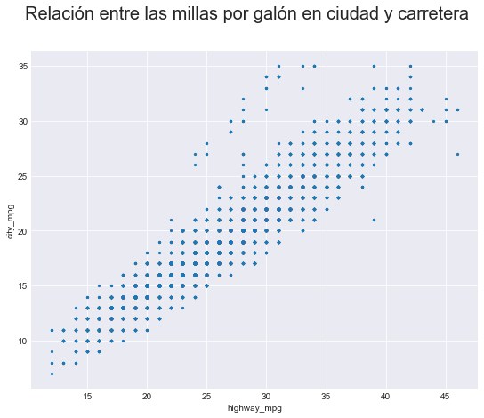
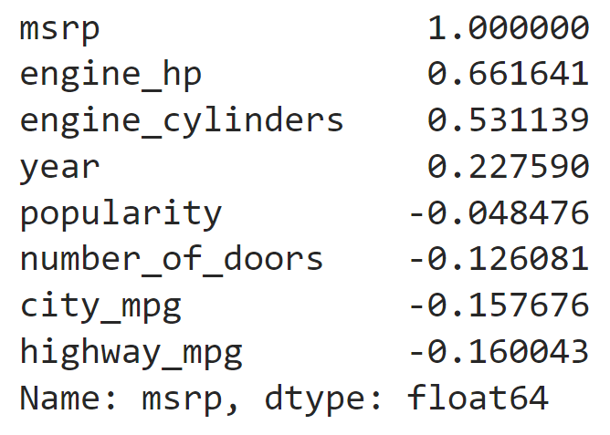
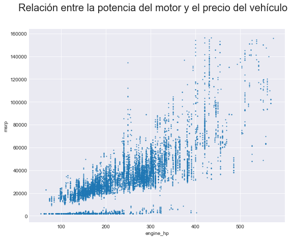
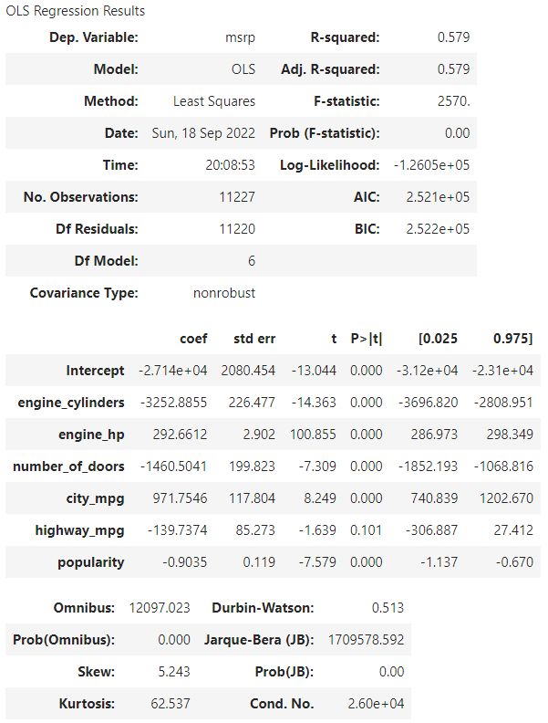
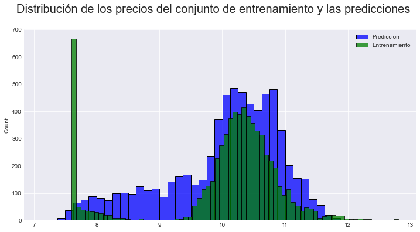
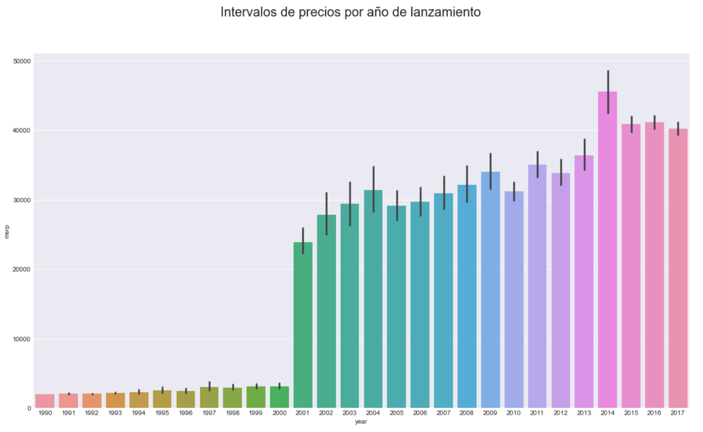

# Determining the price of a vehicle from its characteristics and other relations

In this project are accomplished the following objectives:

* Analyze the data set of vehicles of different manufacturers and their main characteristics, so that clean and implicit information is extracted from said set for the benefit of a company that wants to improve its sales and expand the number of customers it reaches.
* Carry out an exploratory analysis of the data available to find patterns or distributions in them, which allows the identification of atypical data in each of the characteristics contained in the data set studied.
* Quantify the connections between the characteristics of the vehicles through models such as linear regressions that predict, among other things, the price of a vehicle according to its particularities.
* Visualize possible relations between vehicle characteristics that decipher behaviors different from those modeled numerically by using box plots, bars, histograms, etc.

## About this project

In order to complete the objectives shown above, the methodology used can be summarized in the following description of each folder:

* 1. EDA: Contains the code with a first analysis of the data studied, and a cleaning of this data is done.
* 2. Analysis: The correlation coefficients between the different variables is studied in two different notebooks: [Linear_regressions.ipynb](https://github.com/cagutierrezgu/My_Portfolio/blob/e1341081cf2baa5fbf03e25f8425b7488bccad84/Car%20prices%20analysis/2.%20Analysis/1.%20Linear_regressions.ipynb), [Multilinear_regressions.ipynb](https://github.com/cagutierrezgu/My_Portfolio/blob/e1341081cf2baa5fbf03e25f8425b7488bccad84/Car%20prices%20analysis/2.%20Analysis/2.%20Multilinear_regressions.ipynb).
* 3. Images: A graphic analysis is done to make statements about the price of a vehicle according to its characteristics and find additional information to the regressions done.

## Models and results

From the exploratory analysis made, a linear regression between the highway_mpg (highway miles per galon) and city_mpg (city miles per galon) variables was studied, as they seemed highly correlated as it shows the next picture:

Which gave a Pearson correlation coefficient of 0.938 after putting away anomalous data or outliers, and it makes sense since both variables measure the fuel cost of a specific car, but on different grounds.

Now, taking into account that the correlation between the manufacturer's suggested retail price (MSRP) and the rest of the numeric variables:

Then, it was made a linear regression between the vehicle price and the engine horse power since graphically it seems:

From the regression mentioned, the Pearson correlation coefficient obtained is 0.778. This result is lower than the regression done before, and it could be due to the data located on the X axis.

It was also studied the possibility that the MSRP variable depended on all the numeric variables of the dataframe, so it was made a multilinear regression and its results are the following:

As it can be seen from the last image, the R^2 score was 0.579. This result is quite worst that the ones seen in the linear regressions, and it could suggest that some variables are not linearly related with the price of a vehicle.

Another possibility studied was to create a multilinear regression from the start, with train and test sets of data, in order to predict the price of a vehicle from its features, and it is shown next

Finally, some graphical analysis was done looking for hide relations between all the variables. For example, the next figure shows the increase of the vehicle prices in this new century:

## Conclusions

The most relevant findings seen throughout the analysis done are the following:

* A study was carried out using the largest amount of data provided by the analyzed dataframe, with the exception of the **market_category** column due to the large amount of missing data, allowing relations to be established between all the variables among themselves and with the vehicle price especially.
* The use of libraries such as *pandas*, *matplotlib*, *seaborn*, among others, contributed to the cleaning of the available data and to the development of an exploratory analysis to direct the type of models to be carried out and the most valuable variables for these; likewise, it allowed to find the type of distribution of some of the variables, for example of *city_mpg* and *highway_mpg*.
* Linear and multilinear regressions made between the different variables accounted for the connections between them, some of the strongest were between the number of miles driven per gallon used in the city and on the highway, and between the number of horsepower strength and price of the vehicle; however, other linear relations made such as launch year and price did not show the best results for a linear regression. On the other hand, the multilinear regressions to determine the price of a vehicle were generally strengthened by increasing the number of independent variables in the model, although the correlation coefficient $R^2$ never exceeded the value of 0.6.
* The graphic resources contributed to a great extent to find possible hidden relationships between all the variables, especially they allowed access to the categorical variables through bar and box diagrams. In the case of the numerical variables, specifically the continuous ones, they were studied by means of histograms that provided their distribution; Likewise, line graphs classified by the value of a categorical variable were useful when predicting variables such as the price of a vehicle or measuring its popularity.
